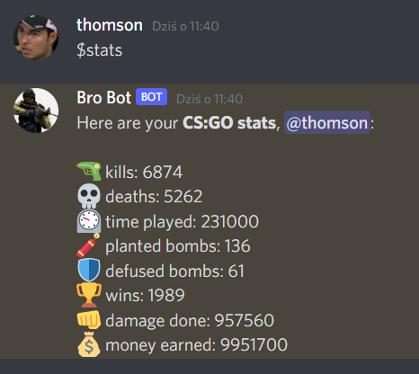
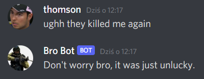
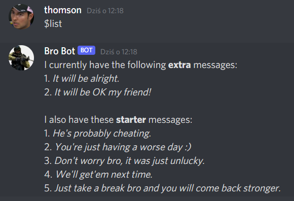
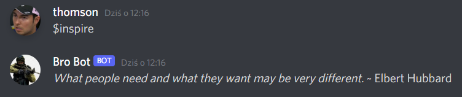
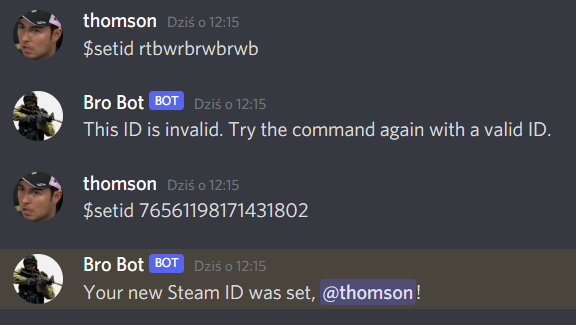

# CSGO-Bot

A Discord bot designed for a Counter Strike: Global Offensive related server. 
It is currently capable of sending encouraging messages when it detects someone's message might have an angry or sad tone.
Furthermore, it can provide users with their most importans CS:GO statistics, such as number of kills or hours played.

As an extra, the bot can send a random inspirational quote.

### Implementation
This bot is written in Python, using Discord's Python API. Steam API is also used, 
wrapped with a special [Python framework for Steam](https://github.com/ValvePython/steam).

### Commands
Having the bot added to your Discord server, you can run the following commands by sending them as text messages:

```$stats``` - will print your CS:GO statistics

```$list``` - will list currently saved encouraging messages

```$new NEW_MESSAGE``` - will add "NEW_MESSAGE" to the list of encouraging messages

```$del INDEX``` - will delete an encouraging message at index INDEX

```$inspire``` - will send you a random inspirational quote, including its author

```$setid STEAM_ID``` - will store your Steam ID (specified as "STEAM_ID") in a database. It will be used to retrieve your statistics when running the `$stats` command

### Usage
To add the bot to your Discord channel, simply follow [this link](https://discord.com/api/oauth2/authorize?client_id=845198409676881930&permissions=2148002880&scope=bot).
Once you are logged in to Discord, it will ask you to choose the server where you want to add the bot. Choose your server and just follow the instructions on the screen.

### Examples
Below are some screenshots from a Discord chat including the CSGO bot (aka Bro Bot).


* Player statistics</p>


* Encouraging message</p>


* List of saved messages</p>


* Inspiring quote</p>


* Setting a Steam ID</p>

